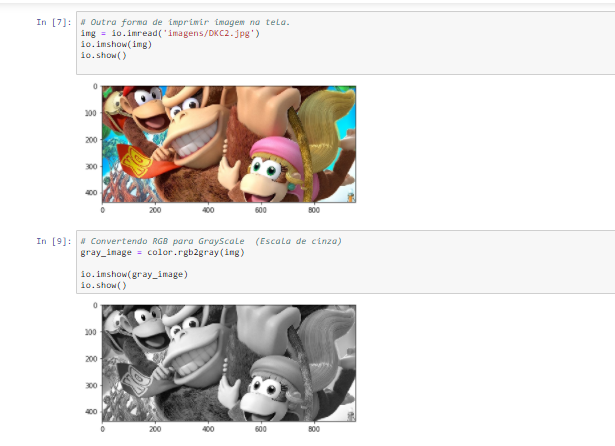

# Sistemas Multimídia - IFMA
Repositório de processamento de imagens e visão computacional

## Introdução

Nesses scripts usamos o scikit-image, opencv e outras bibliotecas.

### Pre requisitos

Instalar e configurar o Anaconda que já vem com o interpretador Python, além de outras bibliotecas, como o scikit-image.

### Outros repositórios (Processamento de Imagens e Visão Computacional)

- ClassifyImage: Aplicação web em Visão Computacional para classificação de imagens.
https://github.com/rcbmdev/ClassifyImage

- SearchObjects: Aplicação web em Visão Computacional para detecção de objetos e criação de dashboards com o Kibana.
https://github.com/rcbmdev/SearchObjects

- RecognizerApp: Aplicação web em Visão Computacional para reconhecimento de imagens faciais.
https://github.com/rcbmdev/RecognizerApp

### Orientações

Os scripts utilizam a IDE Jupyter Notebook e podem ser executadas com o comando jupyter notebook via terminal.

Segue uma demonstração de um script:

